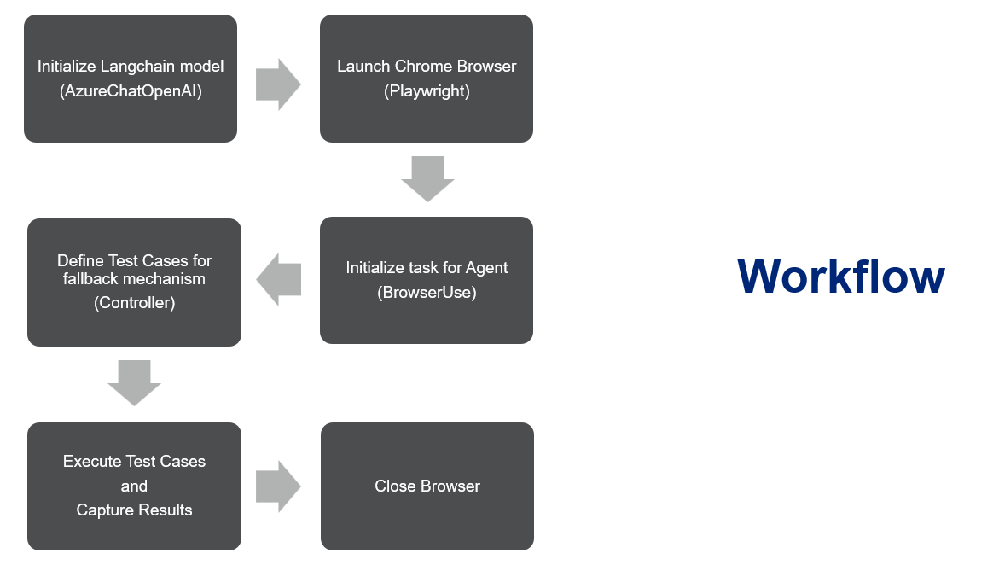
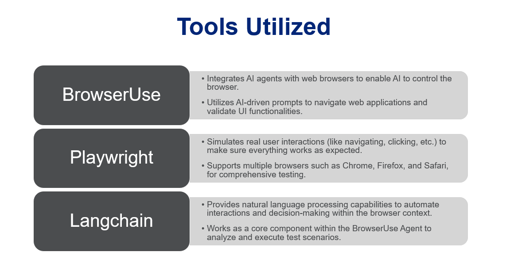
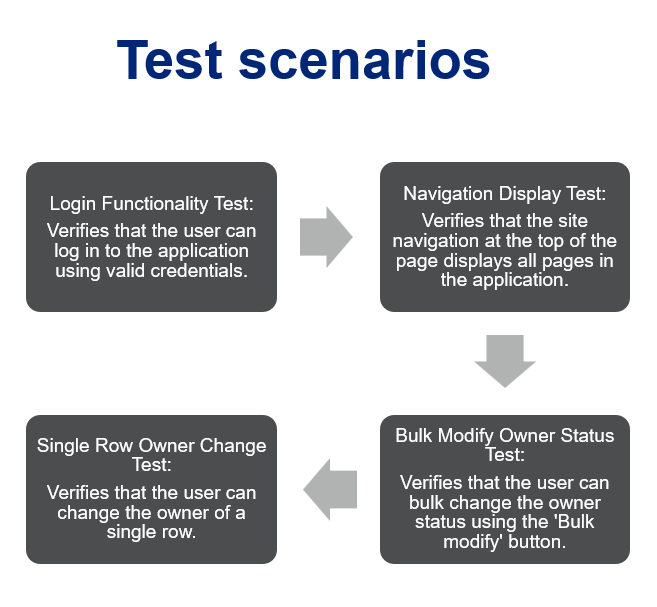

# UI-Testing-Automation-PoC
Automated UI Browser Testing by leveraging Prompt Engineering to dynamically generate BrowserUse prompts, and Playwright
Automation scripts based on test cases, integrated with the Langchain AzureChatOpenAI model, for enhanced testing efficiency.
Utilized BrowserUse to instruct the AI Agent on executing test cases, with Playwright serving as a fallback mechanism to extend the
agent and facilitate custom function calls. Implemented asynchronous execution of test cases, which streamlined the validation of UI application functionalities.

Architecture Workflow -

Tools Utilized to develop this Agentic AI Framework -

Testing scenarios described -

